# NPM Trusted Publishing Setup Guide

This guide explains how to configure NPM trusted publishing with OIDC for all packages in this monorepo.

## What is Trusted Publishing?

NPM trusted publishing uses OpenID Connect (OIDC) to securely publish packages from GitHub Actions without needing long-lived NPM tokens. This provides:

✅ **No token management** - No need to store, rotate, or manage NPM tokens
✅ **Enhanced security** - Short-lived, workflow-specific credentials
✅ **Automatic provenance** - Cryptographic verification of package origin
✅ **Supply chain security** - Verifiable build attestations

## How the Self-Bootstrapping Workflow Works

The release workflow automatically handles both new and existing packages:

### For New Packages (First Publish)
1. 🔍 Workflow detects package doesn't exist on npm
2. 🔑 Uses NPM_TOKEN for initial publish
3. 📋 Logs notification with npm settings URL
4. ⚙️ **Action Required:** Configure OIDC trusted publisher on npmjs.com

### For Existing Packages
1. 🔍 Workflow detects package exists
2. 🔐 npm CLI tries OIDC first (if configured)
3. 🔑 Falls back to NPM_TOKEN if OIDC not configured
4. 💡 **Recommended:** Configure OIDC to remove token dependency

### After OIDC Configuration
1. ✅ All publishes use OIDC automatically
2. 🔒 No token needed
3. 🛡️ Provenance automatically generated
4. 🔗 Enhanced supply chain security

## Prerequisites

- Repository field must be set in package.json (already configured ✅)
- GitHub Actions workflow must use cloud-hosted runners (already configured ✅)
- npm CLI 11.5+ (GitHub Actions runners have this ✅)
- NPM_PUBLISH_TOKEN secret configured (for new package bootstrap)

## Setup Instructions

### Step 1: Configure NPM_PUBLISH_TOKEN Secret (One-time)

Set up the NPM token secret for bootstrapping new packages:

1. Generate an automation token at: https://www.npmjs.com/settings/YOUR_USERNAME/tokens
   - Choose **"Automation"** token type
   - Give it publish permissions
2. Add to GitHub repository secrets:
   - Go to: `https://github.com/hitoshura25/devtools-mcp/settings/secrets/actions`
   - Click **"New repository secret"**
   - Name: `NPM_PUBLISH_TOKEN`
   - Value: Your npm token (`npm_xxxxxxxxxxxxxxxxxxxxxx`)

**Note:** This token is only used as a fallback for new packages or when OIDC isn't configured yet.

### Step 2: Publish Package (Automatic)

**No manual action needed!** The workflow automatically handles first publish:

```bash
# On your feature branch, create a changeset:
pnpm changeset

# Commit and merge to main
# → CI creates "Version Packages" PR
# → Merge Version PR
# → Release workflow automatically publishes (using NPM_TOKEN for new packages)
```

After the workflow runs, check the logs for npm settings URLs if new packages were published.

### Step 3: Configure Trusted Publisher on npm.com

For **each package**, configure the trusted publisher:

1. Go to [npmjs.com](https://www.npmjs.com) and log in
2. Navigate to package settings: `https://www.npmjs.com/package/@hitoshura25/PACKAGE_NAME`
3. Click on "Settings" tab
4. Scroll to **"Trusted Publisher"** section
5. Click **"Add a publisher"**
6. Select **"GitHub Actions"**
7. Fill in the details:

| Field | Value |
|-------|-------|
| **Organization or Username** | `hitoshura25` |
| **Repository** | `devtools-mcp` |
| **Workflow filename** | `release.yml` |
| **Environment** | *(leave empty)* |

8. Click **"Add trusted publisher"**

### Step 4: Repeat for All Packages

Configure trusted publishing for each package:

- [ ] `@hitoshura25/mcp-android` - https://www.npmjs.com/package/@hitoshura25/mcp-android/settings
- [ ] `@hitoshura25/core` (if publishing separately)
- [ ] *(Add future MCP server packages here)*

### Step 5: Remove NPM Token Secret (Optional)

Once all packages are configured for trusted publishing:

1. Go to GitHub repository settings
2. Navigate to **Secrets and variables** → **Actions**
3. **Delete** the `NPM_PUBLISH_TOKEN` secret (no longer needed)
4. All future publishes will use OIDC exclusively

## Verification

After setup, when you merge a "Version Packages" PR:

1. The `release.yml` workflow will run
2. Check workflow logs for: `Publishing packages to npm via OIDC`
3. Verify published packages have provenance badges on npmjs.com
4. Check package page for "Provenance" section showing GitHub Actions attestation

## How It Works

```mermaid
sequenceDiagram
    participant GHA as GitHub Actions
    participant npm as npm Registry
    participant OIDC as GitHub OIDC Provider

    GHA->>OIDC: Request OIDC token
    OIDC->>GHA: Return workflow-scoped token
    GHA->>npm: Publish with OIDC token
    npm->>OIDC: Verify token signature
    OIDC->>npm: Token valid ✓
    npm->>npm: Publish package with provenance
```



## Troubleshooting

### "Package published but using NPM_TOKEN instead of OIDC"

This means OIDC trusted publisher is not configured yet for this package.

**Solution:**
1. Check workflow logs for the npm settings URL
2. Configure trusted publisher on npmjs.com (see Step 3 above)
3. Next publish will use OIDC automatically

### Error: "No valid authentication token"

This means both OIDC and NPM_TOKEN authentication failed.

**Solution:**
1. Verify `NPM_PUBLISH_TOKEN` secret exists in GitHub repository secrets
2. Ensure the token has publish permissions
3. For existing packages, verify OIDC is configured on npmjs.com

### Error: "Workflow name mismatch"

**Solution:** Ensure the workflow filename in npm settings matches exactly: `release.yml`

### "Workflow succeeded but package not published"

Check if there were any packages with version changes:

**Solution:**
1. Verify changesets exist in `.changeset/` directory
2. Check that "Version Packages" PR was merged
3. Look for "No packages to publish" message in workflow logs

## Resources

- [NPM Trusted Publishers Documentation](https://docs.npmjs.com/trusted-publishers/)
- [GitHub Blog: NPM Trusted Publishing](https://github.blog/changelog/2025-07-31-npm-trusted-publishing-with-oidc-is-generally-available/)
- [NPM Provenance Documentation](https://docs.npmjs.com/generating-provenance-statements)
